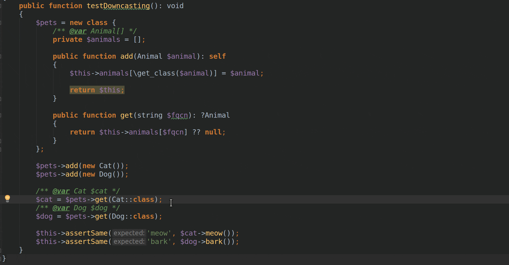

# TypeCasting - kind of explicit type casting in PHP

Neither real [covariance](https://en.wikipedia.org/wiki/Covariance_and_contravariance_(computer_science)) in method return type hints, nor [explicit type casting](https://www.baeldung.com/java-type-casting) are supported in PHP.

Sometimes it is useful to downcast object, so PhpStorm or PHPStan stop complaining about absent methods or mismatched types.

Usually [@var](http://docs.phpdoc.org/references/phpdoc/tags/var.html) tag used for this. But as with all phpdoc tags in regard of typing, this is simply telling your IDE or static analyzer tool to take your honest word that you know for sure the type of the stuff.

Whereas with actual type casting (like say in java, C# or even in PHP, but only for primitives) you can be sure that object (or primitive) is "castable" into specified type, or end up with exception.

So you can plug `\TypeCasting\TypeCasting` trait into your class (but only one per inheritance chain) and then use `cast` method that is a bit like [`Java.lang.Class.cast`](https://www.tutorialspoint.com/java/lang/class_cast.htm) method (but of course this is oversimplified comparison).

